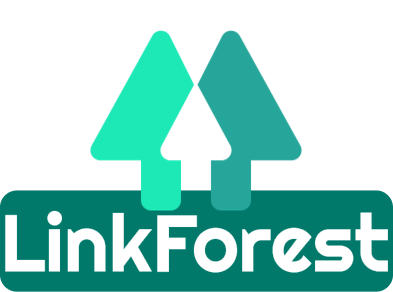
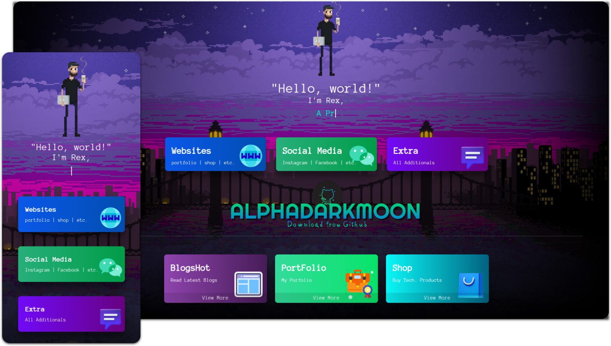

# LinkForest: Navigating a Curated Pathway of Links

Welcome to LinkForest, your curated pathway to a plethora of links. Journey effortlessly through this digital realm, unlocking a spectrum of resources, insights, and connections with just a click. Explore and discover, for here lies a hub tailored just for you. Let's navigate through this digital forest together!

## Latest Version: [v1.0]()

## Description

LinkForest is a beautifully designed LinkTree page crafted using Bootstrap 5, incorporating HTML, CSS, and JavaScript.

You can utilize this platform to organize all your links in one centralized location. It's versatile and can be effectively used across various platforms such as Instagram, Facebook, or any other social media platform.

To customize LinkForest according to your specific needs, follow the [Docs]() (Documentation) where you'll find guidance on modifying the layout and content.

Furthermore, the documentation will educate you on how to host any static website for free.

- Understanding Static Websites: A static website is a type of website that delivers content exactly as it is stored to the user's web browser. The content is fixed and remains the same regardless of who is accessing the website or when they access it. It's typically written in HTML and CSS, and sometimes includes a bit of JavaScript for interactivity, but the content doesn't change dynamically.
  - some common examples are resume websites, portfolio websites, brochure websites, one-off landing pages, and other informational or read-only sites.

# Documentation

There is a proper Documentation that will teach you how to edit and update the Website as per your needs and requirements.

Read the Docs carefully | [Documentation](https://alphadarkmoon.github.io/docs.github.io/Docs/LinkForest/index.html)

## Tools

- Html
- Css
- JavaScript
- Bootstrap 5

## Developers

- [AlphaDarkmoon](https://github.com/AlphaDarkmoon)

## Source & Credits

- **Images / icons:**

  - [Wallpaper Abyss](https://wall.alphacoders.com)
  - [Icons8](https://icons8.com/)

- **Fonts:**

  - [CSS Fonts](https://fonts.googleapis.com/css?family=Anonymous+Pro)

- **Scripts:**
  - [jQuery](http://www.jquery.com/)
  - [Bootstrap 5](http://getbootstrap.com/)
  - [Fontawesome](https://example.com/fontawesome/v5.15.4/js/all.js)

## Support

If this documentation doesn't answer your questions, please contact us via:

- Email: omnishots.alpha@gmail.com
- Reddit: u/RekkusuYash
- Instagram: @alphadarkmoon.github

We are located in GMT +5:30 time zone and we answer all questions within 12-24 hours on weekdays. In some rare cases, the waiting time can be up to 48 hours (except holiday seasons, which might take longer). Don’t forget to give a ⭐ on this template on Github.

## MIT License

Copyright <2023> <COPYRIGHT AlphaDarkmoon>

Permission is hereby granted, free of charge, to any person obtaining a copy of this software and associated documentation files (the “Software”), to deal in the Software without restriction, including without limitation the rights to use, copy, modify, merge, publish, distribute, sublicense, and/or sell copies of the Software, and to permit persons to whom the Software is furnished to do so, subject to the following conditions:

The above copyright notice and this permission notice shall be included in all copies or substantial portions of the Software.

THE SOFTWARE IS PROVIDED “AS IS”, WITHOUT WARRANTY OF ANY KIND, EXPRESS OR IMPLIED, INCLUDING BUT NOT LIMITED TO THE WARRANTIES OF MERCHANTABILITY, FITNESS FOR A PARTICULAR PURPOSE AND NONINFRINGEMENT. IN NO EVENT SHALL THE AUTHORS OR COPYRIGHT HOLDERS BE LIABLE FOR ANY CLAIM, DAMAGES OR OTHER LIABILITY, WHETHER IN AN ACTION OF CONTRACT, TORT OR OTHERWISE, ARISING FROM, OUT OF OR IN CONNECTION WITH THE SOFTWARE OR THE USE OR OTHER DEALINGS IN THE SOFTWARE.

---

#### All contributions Accepted.